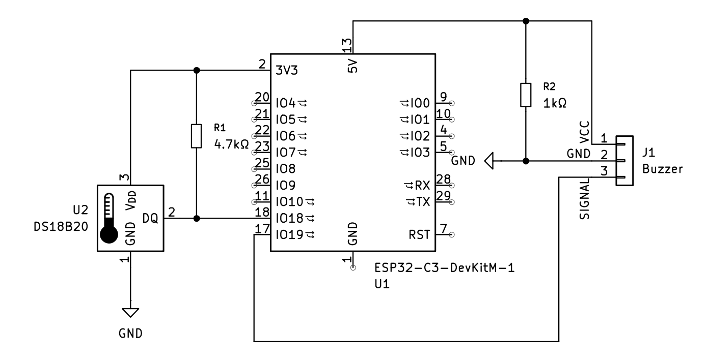
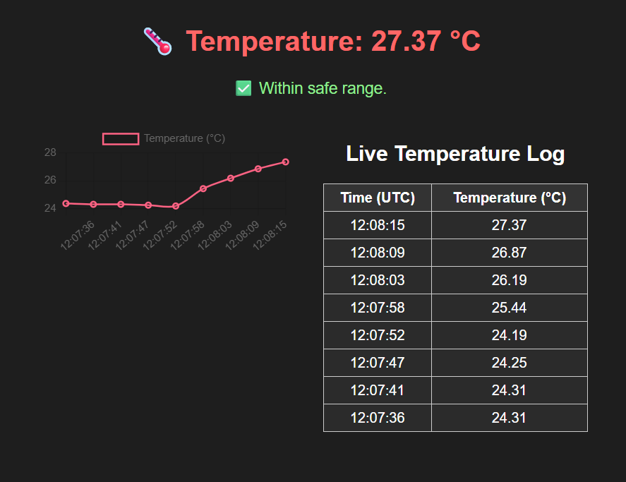

# 🌡️ ESP32-C3 Temperature Monitor with Web Dashboard

A real-time web-based temperature monitoring system using an **ESP32-C3 Mini-1 DevKit V1**, a **DS18B20 digital temperature sensor**, and a **3-wire active buzzer**.  
It serves a live webpage with temperature readings, alert system, interactive chart, and historical log — auto-updating every 5 seconds.

---

## 🚀 Features

- Live temperature monitoring via built-in web server
- Auto-refreshing webpage every 5s
- Overheat alert with buzzer
- Dynamic temperature chart (Chart.js)
- Live table log of recent measurements with UTC timestamps
- No cloud dependencies – fully offline-capable

---

## 🔌 Hardware Connections


| Component         | ESP32 Pin      | Notes                                                                 |
|------------------|----------------|-----------------------------------------------------------------------|
| **DS18B20**       |                |                                                                       |
| • Data (Yellow)   | `GPIO18`       | Use 4.7 kΩ **pull-up resistor** between GPIO18 and 3.3V               |
| • VCC (Black)     | `3.3V`         | Powers the sensor                                                    |
| • GND (Red)       | `GND`          | Ground connection                                                    |
| **Buzzer (3-wire)** |              |                                                                       |
| • Signal (Gray)   | `GPIO19`       | Controls the buzzer                                                  |
| • VCC (Red)       | `5V`           | Connect to 5V output of ESP32 (if available)                          |
| • GND (Black)     | `GND`          | Ground connection                                                    |
| • Pull-down       | `GPIO19 → GND` | Add **1 kΩ resistor** between GPIO19 and GND                         |

---

## 🧠 How It Works

- On startup, the ESP32 connects to Wi-Fi and starts a local HTTP server.
- It queries the DS18B20 sensor every 5 seconds.
- Temperature is logged and displayed on a hosted webpage.
- If the temperature exceeds a configurable threshold (default: 30 °C), the buzzer is triggered.
- Users can monitor the temperature chart and log history remotely by visiting the ESP32's IP address.

---
## 🖧 Schematic



---
## 🧭 Circuit Diagram

The following schematic illustrates the wiring:


---
## 📷 Web Interface

Here is a live view of the ESP32 web dashboard:



---

## 🛠️ Requirements

- **Board:** ESP32-C3 Mini-1 DevKit V1  
- **Sensor:** DS18B20 (digital)  
- **Libraries:**
  - WiFi
  - WebServer
  - OneWire
  - DallasTemperature

---
## 📁 Project Structure

```text
.
├── ESP32-C3andThermistorCode.ino           # Main Arduino source code
├── LICENSE                                 # MIT License file
├── README.md                               # Project documentation
├── .gitignore                              # Git ignore rules
└── images/
    ├── esp_tempsensor_circuit_kicad.png    # Circuit in KiCad
    ├── circuit.png                         # Circuit schematic
    ├── screenshot.png                      # Web interface screenshot
    └── .gitkeep                            # Keeps the folder tracked by Git
    
